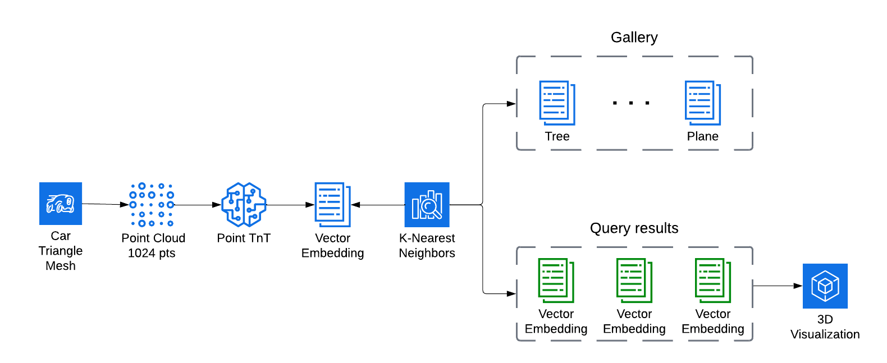
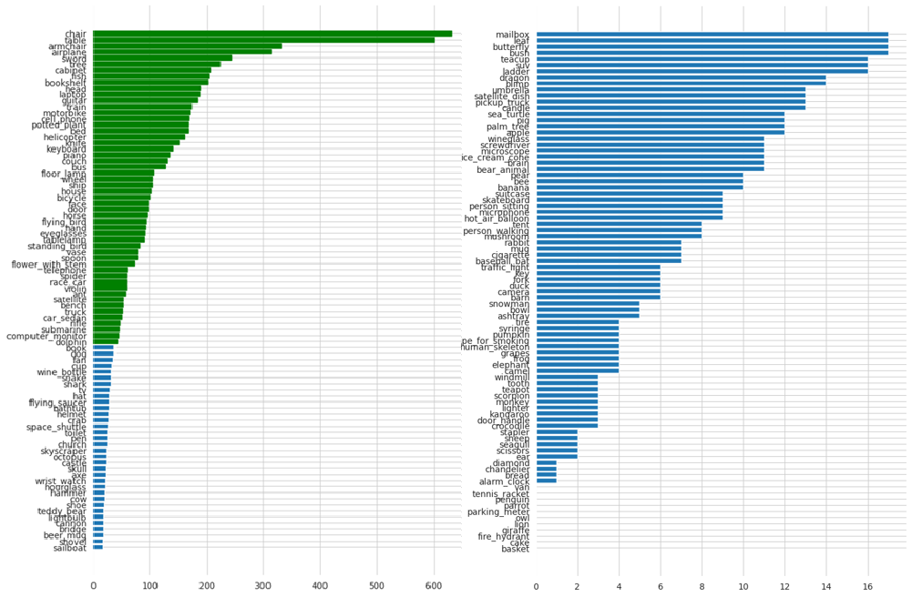
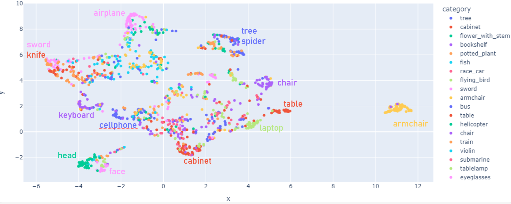

# ShapeRetrieval: find similar objects based on input shape
<p align="center">   </p>
The goal of the project is to assess how well point-based networks are able to learn 3D features and cluster together similar objects.

In particular the the main components used are:
* Dataset: [SHREC14](https://www.researchgate.net/publication/262104554_SHREC%2714_Track_Extended_Large_Scale_Sketch-Based_3D_Shape_Retrieval#fullTextFileContent)
* Network: [Point-TnT](https://arxiv.org/abs/2204.03957)
* Loss: [Contrastive loss](https://towardsdatascience.com/contrastive-loss-explaned-159f2d4a87ec)
* Retrieval: [K-Nearest Neighbor](https://scikit-learn.org/stable/modules/neighbors.html)

## Install
All the dependencies can be installed with the following command:
```
pip install -r requirements.txt
```

## Training
```
python train.py --data_root data --exp_dir test_exp
```
Data will be downloaded automatically if not present yet

## Test
```
python test.py --data_root data --exp_dir point_tnt_exp --category chair
```

## Process
<p align="center"></p>

The **SHREC14 dataset** has been converted from a mesh representation to a point cloud representation of 1024 points per sample. The network has then been trained on point-based data with contrastive loss for **100 epochs**.


Afterwards, all the point-based data has been encoded to vectors of dimension 512, building the so called **Gallery**. Which is then used for K-Nearest Neighbor search to find the K closest elements to the input query.

## Dataset
Model has been trained on the top 52 categories, containing at least 42 samples:
| Split    | Samples |
| -------- | ------- |
| Train  | 5400    |
| Test | 1351     |
| Total    | 6751    |
<p align="center"></p>


## Results
<p align="center">UMAP dimensionality reduction to visualize how well the network separates the samples</p>
<p align="center"></p>

Recall @ K metric
| Nieghbours    | Recall |
| -------- | ------- |
| K=1  | 56.48%      |
| K=2  | 68.39%      |
| K=4  | 76.76%      |
| K=6  | 82.16%      |
| K=8  | 85.79%      |
| K=10 | 87.56%      |

## Citation
If you find this work useful, please consider citing it and other works:
```
@article{ShapeRetrieval,
      Author = {Iulian Zorila},
      Title = {ShapeRetrieval/Point-TnT},
      Journal = {https://github.com/iulianzorila/ShapeRetrieval/tree/main},
      Year = {2023}
}
```

```
@article{berg2022points,
  title={Points to Patches: Enabling the Use of Self-Attention for 3D Shape Recognition},
  author={Berg, Axel and Oskarsson, Magnus and O'Connor, Mark},
  journal={arXiv preprint arXiv:2204.03957},
  year={2022}
}
```


